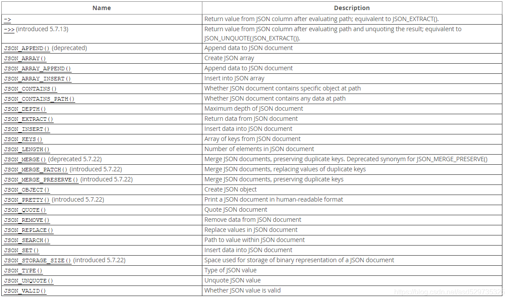
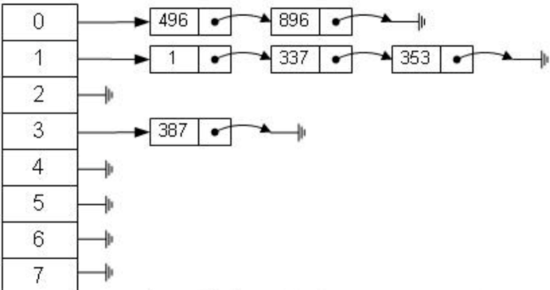
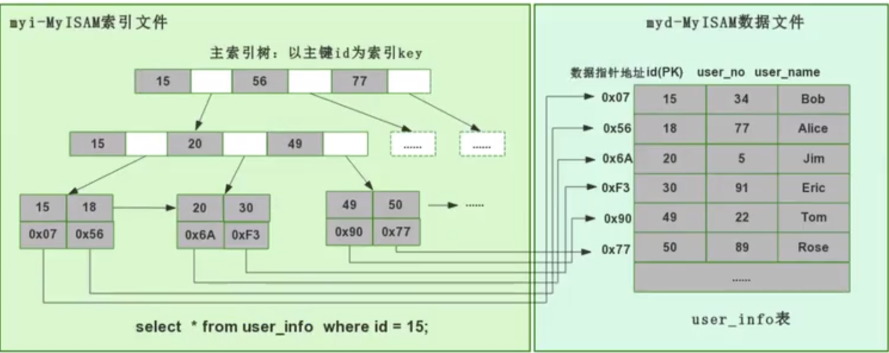
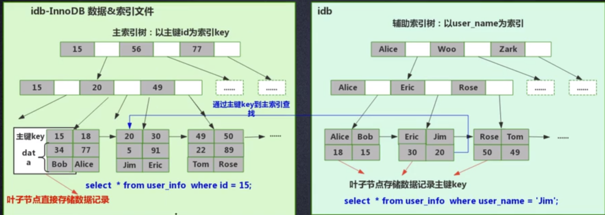

- [**Mysql**](#mysql)
  - [Json数据操作](#json数据操作)
    - [基础查询](#基础查询)
    - [函数查询](#函数查询)
      - [json函数：](#json函数)
      - [JSON\_KEYS](#json_keys)
      - [新增json](#新增json)
      - [JSON\_SET() ：将数据插入JSON格式中，有key则替换，无key则新增](#json_set-将数据插入json格式中有key则替换无key则新增)
      - [JSON\_INSERT():插入值（往json中插入新值，但不替换已经存在的旧值）](#json_insert插入值往json中插入新值但不替换已经存在的旧值)
      - [JSON\_REPLACE](#json_replace)
      - [JSON\_REMOVE() ：从JSON文档中删除数据](#json_remove-从json文档中删除数据)
      - [JSON\_SEARCH](#json_search)
  - [Mysql 索引底层数据结构选型](#mysql-索引底层数据结构选型)
    - [哈希表（Hash）](#哈希表hash)
    - [二叉查找树(BST)](#二叉查找树bst)
    - [AVL 树和红黑树](#avl-树和红黑树)
    - [B 树](#b-树)
    - [B+树](#b树)
    - [Innodb 引擎和 Myisam 引擎的实现](#innodb-引擎和-myisam-引擎的实现)
      - [MyISAM 引擎的底层实现（非聚集索引方式）](#myisam-引擎的底层实现非聚集索引方式)
      - [Innodb 引擎的底层实现（聚集索引方式）](#innodb-引擎的底层实现聚集索引方式)
    - [总结](#总结)
      - [B+树一个节点有多大？一千万条数据，B+树多高？](#b树一个节点有多大一千万条数据b树多高)

# **Mysql**
```sql
ALTER TABLE `bigdata_core`.`bigdata_net_log_online_details` 
MODIFY COLUMN `create_time` datetime DEFAULT CURRENT_TIMESTAMP;
```

## Json数据操作
> 要求：mysql5.7以上 <br>

### 基础查询
- 创建json字段(不创建也可以对varchar之类的执行json操作) :
```sql
CREATE TABLE `dept` (
  `id` int(11) NOT NULL,
  `dept` varchar(255) DEFAULT NULL,
  `json_value` json DEFAULT NULL,
  PRIMARY KEY (`id`)
) ENGINE=InnoDB DEFAULT CHARSET=utf8;
```
- 示例数据：
```sql
insert into dept VALUES(1,'部门1','{"deptName": "部门1", "deptId": "1", "deptLeaderId": "3"}');
insert into dept VALUES(2,'部门2','{"deptName": "部门2", "deptId": "2", "deptLeaderId": "4"}');
insert into dept VALUES(3,'部门3','{"deptName": "部门3", "deptId": "3", "deptLeaderId": "5"}');
insert into dept VALUES(4,'部门4','{"deptName": "部门4", "deptId": "4", "deptLeaderId": "5"}');
insert into dept VALUES(5,'部门5','{"deptName": "部门5", "deptId": "5", "deptLeaderId": "5"}');

  ```
*-* 查询操作:
  
```sql
-- 单条件
SELECT * from dept WHERE json_value->'$.deptLeaderId'='5';
-- 多字段条件
SELECT * from dept WHERE json_value->'$.deptLeaderId'='5' and dept='部门3';
-- 多jsonvalue条件
SELECT * from dept WHERE json_value->'$.deptLeaderId'='5' and json_value->'$.deptId'='5';

```
### 函数查询
#### json函数：<br>


*-* json_extract
```sql
select id,json_extract(json_value,'$.deptName') as deptName from dept;
```
#### JSON_KEYS
```sql
--  可以将key取出来,value没取
SELECT JSON_KEYS(json_value) FROM dept 
```
#### 新增json
#### JSON_SET() ：将数据插入JSON格式中，有key则替换，无key则新增
```sql
-- 比如我们想针对id=2的数据新增一组：newData:新增的数据,修改deptName为新增的部门1
update dept set json_value=JSON_SET('{"deptName": "部门2", "deptId": "2", "deptLeaderId": "4"}','$.deptName','新增的部门1','$.newData','新增的数据') WHERE id=2;

select * from dept WHERE id =2

-- id dept json_value 
-- 2 部门2   {"deptld”："2"，“newData”：“新增的数据”，“deptName”：“新增的部门1"，"deptleaderld”：“4”}


-- 如果不带这个单元格之前的值，之前的值是会新值被覆盖的，比如我们如果更新的语句换成:

update dept set json_value=JSON_SET('{"a":"1","b":"2"}','$.deptName','新增的部门1','$.newData','新增的数据') WHERE id=2

-- 2  部门2 {a':"1",，"b"："2"，"newData"：“新增的数据"，"deptName”：“新增的部门]1"}

```
#### JSON_INSERT():插入值（往json中插入新值，但不替换已经存在的旧值）
```sql
UPDATE dept set json_value=JSON_INSERT('{"a": "1", "b": "2"}', '$.deptName', '新增的部门2','$.newData2','新增的数据2') 
WHERE id=2
-- 2  部门2 {”a"："1"，"b"："2"，"deptName”：“新增的部门2"，"newData2"：“新增的数据2"}

```

#### JSON_REPLACE
```sql
UPDATE dept set json_value=JSON_REPLACE('{"a": "1", "b": "2", "deptName": "新增的部门2", "newData2": "新增的数据2"}', '$.newData2', '更新的数据2') WHERE id =2;

select * from dept WHERE id =2

-- 2  部门2 {"a"："1"，"b":"2"，"deptName”：“新增的部门2"，"newData2"："更新的数据2"}

```
#### JSON_REMOVE() ：从JSON文档中删除数据
```sql
-- 删除key为a的字段。
UPDATE dept set json_value=JSON_REMOVE('{"a": "1", "b": "2", "deptName": "新增的部门2", "newData2": "更新的数据2"}','$.a') WHERE id =2;
```


#### JSON_SEARCH
```sql
mysql> SET @j = '["abc", [{"k": "10"}, "def"], {"x":"abc"}, {"y":"bcd"}]';

-- 对比one和all的区别
-- 很直观的能看除one获取到一个符合条件的路径后就终止了，而all则返回全部

mysql> SELECT JSON_SEARCH(@j, 'one', 'abc');
+-------------------------------+
| JSON_SEARCH(@j, 'one', 'abc') |
+-------------------------------+
| "$[0]"                        |
+-------------------------------+

mysql> SELECT JSON_SEARCH(@j, 'all', 'abc');
+-------------------------------+
| JSON_SEARCH(@j, 'all', 'abc') |
+-------------------------------+
| ["$[0]", "$[2].x"]            |
+-------------------------------+

-- 若搜索内容不存在，则返回NULL

mysql> SELECT JSON_SEARCH(@j, 'all', 'ghi');
+-------------------------------+
| JSON_SEARCH(@j, 'all', 'ghi') |
+-------------------------------+
| NULL                          |
+-------------------------------+

-- 模糊匹配
mysql> SELECT JSON_SEARCH(@j, 'all', '%a%');
+-------------------------------+
| JSON_SEARCH(@j, 'all', '%a%') |
+-------------------------------+
| ["$[0]", "$[2].x"]            |
+-------------------------------+

mysql> SELECT JSON_SEARCH(@j, 'all', '%b%');
+-------------------------------+
| JSON_SEARCH(@j, 'all', '%b%') |
+-------------------------------+
| ["$[0]", "$[2].x", "$[3].y"]  |
+-------------------------------+

# 指定搜索路径，$[0] = "abc"
mysql> SELECT JSON_SEARCH(@j, 'all', '%b%', NULL, '$[0]');
+---------------------------------------------+
| JSON_SEARCH(@j, 'all', '%b%', NULL, '$[0]') |
+---------------------------------------------+
| "$[0]"                                      |
+---------------------------------------------+

# $[2] = {"x":"abc"}
mysql> SELECT JSON_SEARCH(@j, 'all', '%b%', NULL, '$[2]');
+---------------------------------------------+
| JSON_SEARCH(@j, 'all', '%b%', NULL, '$[2]') |
+---------------------------------------------+
| "$[2].x"                                    |
+---------------------------------------------+

# $[1] = [{"k": "10"}, "def"] 模糊匹配无结果
mysql> SELECT JSON_SEARCH(@j, 'all', '%b%', NULL, '$[1]');
+---------------------------------------------+
| JSON_SEARCH(@j, 'all', '%b%', NULL, '$[1]') |
+---------------------------------------------+
| NULL                                        |
+---------------------------------------------+

mysql> SELECT JSON_SEARCH(@j, 'all', '%b%', '', '$[1]');
+-------------------------------------------+
| JSON_SEARCH(@j, 'all', '%b%', '', '$[1]') |
+-------------------------------------------+
| NULL                                      |
+-------------------------------------------+

mysql> SELECT JSON_SEARCH(@j, 'all', '%b%', '', '$[3]');
+-------------------------------------------+
| JSON_SEARCH(@j, 'all', '%b%', '', '$[3]') |
+-------------------------------------------+
| "$[3].y"                                  |
+-------------------------------------------+


```

实例
```sql
Create Table: CREATE TABLE `user` (
  `id` int(11) unsigned NOT NULL AUTO_INCREMENT,
  `name` varchar(64) NOT NULL COMMENT '名字',
  `age` int(4) unsigned NOT NULL COMMENT '年龄',
  `info` text COMMENT '补充信息',
  PRIMARY KEY (`id`),
  UNIQUE KEY `name` (`name`)
) ENGINE=InnoDB DEFAULT CHARSET=utf8 COMMENT='用户表'
-- 插入用户数据
INSERT INTO `suhw`.`user` (`name`, `age`, `info`) VALUES ('suhw', '23', '{"phone":"12312123434","language":["c++","java","go"]}');
INSERT INTO `suhw`.`user` (`name`, `age`, `info`) VALUES ('bob', '20', '{"phone":"18912123434","language":["c++","c","go","php"]}');

-- 查询会go语言的用户
mysql> select * from user where JSON_SEARCH(info, 'all', 'go', NULL, '$.language') IS NOT NULL\G
*************************** 1. row ***************************
  id: 1
name: suhw
 age: 23
info: {"phone":"12312123434","language":["c++","java","go"]}
*************************** 2. row ***************************
  id: 2
name: bob
 age: 20
info: {"phone":"18912123434","language":["c++","c","go","php"]}
2 rows in set (0.00 sec)


```


## Mysql 索引底层数据结构选型
### 哈希表（Hash）
>哈希算法：也叫散列算法，就是把任意值(key)通过哈希函数变换为固定长度的 key 地址，通过这个地址进行具体数据的数据结构
对于下面这个表：
```sql
select * from user where id=7;
```
哈希算法首先计算存储 id=7 的数据的物理地址 addr=hash(7)=4231，而 4231 映射的物理地址是 0x77，0x77 就是 id=7 存储的额数据的物理地址，通过该独立地址可以找到对应 user_name='g'这个数据。这就是哈希算法快速检索数据的计算过程。

>但是哈希算法有个数据碰撞的问题，也就是哈希函数可能对不同的 key 会计算出同一个结果，比如 hash(7)可能跟 hash(199)计算出来的结果一样，也就是不同的 key 映射到同一个结果了，这就是碰撞问题。解决碰撞问题的一个常见处理方式就是链地址法，即用链表把碰撞的数据接连起来。计算哈希值之后，还需要检查该哈希值是否存在碰撞数据链表，有则一直遍历到链表尾，直达找到真正的 key 对应的数据为止。



从算法时间复杂度分析来看，哈希算法时间复杂度为 O（1），检索速度非常快。比如查找 id=7 的数据，哈希索引只需要计算一次就可以获取到对应的数据，检索速度非常快。但是 Mysql 并没有采取哈希作为其底层算法...

>因为考虑到数据检索有一个常用手段就是范围查找,哈希算法实现的索引虽然可以做到快速检索数据，但是没办法做数据高效范围查找.

### 二叉查找树(BST)
二叉查找树的时间复杂度是 O(lgn)，相对于直接遍历查询省了一半的时间.
范围查找也很容易实现，大于的查找对应的右子树就行

>但是普通的二叉查找树有个致命缺点：极端情况下会退化为线性链表，二分查找也会退化为遍历查找，时间复杂退化为 O（N），检索性能急剧下降。

在数据库中，数据的自增是一个很常见的形式，比如一个表的主键是 id，而主键一般默认都是自增的，如果采取二叉树这种数据结构作为索引，那上面介绍到的不平衡状态导致的线性查找的问题必然出现。因此，简单的二叉查找树存在不平衡导致的检索性能降低的问题，是不能直接用于实现 Mysql 底层索引的。

### AVL 树和红黑树
二叉查找树存在不平衡问题，因此学者提出通过树节点的自动旋转和调整，让二叉树始终保持基本平衡的状态，就能保持二叉查找树的最佳查找性能了。

基于这种思路的自调整平衡状态的二叉树有 AVL 树和红黑树。

首先简单介绍红黑树，这是一颗会自动调整树形态的树结构，比如当二叉树处于一个不平衡状态时，红黑树就会自动左旋右旋节点以及节点变色，调整树的形态，使其保持基本的平衡状态（时间复杂度为 O（logn）），也就保证了查找效率不会明显减低。

>红黑树问题：顺序插入时，仍然会有一定的右倾趋势，虽然没有二叉查找树那么严重，但是当主键Id自增到几百万上千万，性能消耗还是比较大的。


AVL 树就是一个更为严格的自平衡二叉树,这意味着他需要保证绝对平衡,在调整上消耗的性能也会更多.

从查找效率而言，AVL 树查找的速度要高于红黑树的查找效率.

从树的形态看来，AVL 树不存在红黑树的“右倾”问题。也就是说，大量的顺序插入不会导致查询性能的降低，这从根本上解决了红黑树的问题。

>但AVL树有另一个缺点:

- 数据库查询数据的瓶颈在于磁盘 IO，如果使用的是 AVL 树，我们每一个树节点只存储了一个数据，我们一次磁盘 IO 只能取出来一个节点上的数据加载到内存里，那比如查询 id=7 这个数据我们就要进行磁盘 IO 三次，这是多么消耗时间的。
- 所以我们设计数据库索引时需要首先考虑怎么尽可能减少磁盘 IO 的次数。

磁盘 IO 有个有个特点，就是从磁盘读取 1B 数据和 1KB 数据所消耗的时间是基本一样的，我们就可以根据这个思路，我们可以在一个树节点上尽可能多地存储数据，一次磁盘 IO 就多加载点数据到内存，这就是 B 树，B+树的的设计原理了。

### B 树
- 通过限制每个节点存储尽可能多的数据来减少磁盘IO.
- 相比于AVL树磁盘io性能更好
- 时间复杂度：B 树的查找性能等于 O（h*logn），其中 h 为树高，n 为每个节点关键词的个数；
### B+树
B 树和B+树 区别:
- 第一，B 树一个节点里存的是数据，而 B+树存储的是索引（地址），所以 B 树里一个节点存不了很多个数据，但是 B+树一个节点能存很多索引，B+树叶子节点存所有的数据。
- 第二，B+树的叶子节点是数据阶段用了一个链表串联起来，便于范围查找。( ???没太懂怎么实现的,在树结构的基础上 加上了链表的结构?还是存储了两个结构,噢~ B+树的叶子结点指向的是 链表中的索引地址,所以有两个结构)

B+树结构:


- B+树节点存储的是索引，在单个节点存储容量有限的情况下，单节点也能存储大量索引，使得整个 B+树高度降低，减少了磁盘 IO。
- 其次，B+树的叶子节点是真正数据存储的地方，叶子节点用了链表连接起来，这个链表本身就是有序的，在数据范围查找时，更具备效率。

因此 Mysql 的索引用的就是 B+树，B+树在查找效率、范围查找中都有着非常不错的性能。

### Innodb 引擎和 Myisam 引擎的实现

Mysql 底层数据引擎以插件形式设计，最常见的是 Innodb 引擎和 Myisam 引擎，用户可以根据个人需求选择不同的引擎作为 Mysql 数据表的底层引擎。我们刚分析了，B+树作为 Mysql 的索引的数据结构非常合适，但是数据和索引到底怎么组织起来也是需要一番设计，设计理念的不同也导致了 Innodb 和 Myisam 的出现，各自呈现独特的性能.

>MyISAM 虽然数据查找性能极佳，但是不支持事务处理。Innodb 最大的特色就是支持了 ACID 兼容的事务功能，而且他支持行级锁。

Innodb 创建表后生成的文件有：

- frm:创建表的语句
- idb:表里面的数据+索引文件
  
Myisam 创建表后生成的文件有

- frm:创建表的语句
- MYD:表里面的数据文件（myisam data）
- MYI:表里面的索引文件（myisam index）

MyISAM 引擎把数据和索引分开了，一人一个文件，这叫做非聚集索引方式；

Innodb 引擎把数据和索引放在同一个文件里了，这叫做聚集索引方式。

#### MyISAM 引擎的底层实现（非聚集索引方式）
MyISAM 用的是非聚集索引方式，即数据和索引落在不同的两个文件上。MyISAM 在建表时以主键作为 KEY 来建立主索引 B+树，树的叶子节点存的是对应数据的物理地址。我们拿到这个物理地址后，就可以到 MyISAM 数据文件中直接定位到具体的数据记录了。



为某个字段添加索引时，同样会生成对应字段的索引树.


#### Innodb 引擎的底层实现（聚集索引方式）

InnoDB 是聚集索引方式，因此数据和索引都存储在同一个文件里。首先 InnoDB 会根据主键 ID 作为 KEY 建立索引 B+树，如左下图所示，而 B+树的叶子节点存储的是主键 ID 对应的数据，比如在执行 select * from user_info where id=15 这个语句时，InnoDB 就会查询这颗主键 ID 索引 B+树，找到对应的 user_name='Bob'。

这是建表的时候 InnoDB 就会自动建立好主键 ID 索引树，这也是为什么 Mysql 在建表时要求必须指定主键的原因。当我们为表里某个字段加索引时 InnoDB 会怎么建立索引树呢？比如我们要给 user_name 这个字段加索引，那么 InnoDB 就会建立 user_name 索引 B+树，节点里存的是 user_name 这个 KEY，叶子节点存储的数据的是主键 KEY。注意，叶子存储的是主键 KEY！拿到主键 KEY 后，InnoDB 才会去主键索引树里根据刚在 user_name 索引树找到的主键 KEY 查找到对应的数据。



问题来了，为什么 InnoDB 只在主键索引树的叶子节点存储了具体数据，但是其他索引树却不存具体数据呢，而要多此一举先找到主键，再在主键索引树找到对应的数据呢?

其实很简单，因为 InnoDB 需要节省存储空间。一个表里可能有很多个索引，InnoDB 都会给每个加了索引的字段生成索引树，如果每个字段的索引树都存储了具体数据，那么这个表的索引数据文件就变得非常巨大（数据极度冗余了）。从节约磁盘空间的角度来说，真的没有必要每个字段索引树都存具体数据，通过这种看似“多此一举”的步骤，在牺牲较少查询的性能下节省了巨大的磁盘空间，这是非常有值得的。


>在进行 InnoDB 和 MyISAM 特点对比时谈到，MyISAM 查询性能更好，从上面索引文件数据文件的设计来看也可以看出原因：MyISAM 直接找到物理地址后就可以直接定位到数据记录，但是 InnoDB 查询到叶子节点后，还需要再查询一次主键索引树，才可以定位到具体数据。等于 MyISAM 一步就查到了数据，但是 InnoDB 要两步，那当然 MyISAM 查询性能更高。

### 总结

1. hash很快，但每次IO只能取一个数
2. AVL和红黑树，在大量数据的情况下，IO操作还是太多,还有右倾风险
3. B树每个节点内存储的是数据，因此每个节点存储的分支太少
4. B+节点存储的是索引+指针(引用指向下一个节点)，可以存储大量索引，同时最终数据存储在叶子节点，并且有引用横向链接，可以在2-3次的IO操作内完成千万级别的表操作。
5. 建议索引是是自增长数字，这样适合范围查找

#### B+树一个节点有多大？一千万条数据，B+树多高？
> B+树一个节点的大小设为一页或页的倍数最为合适。
因为如果一个节点的大小 < 1页，那么读取这个节点的时候其实读取的还是一页，这样就造成了资源的浪费。


在 MySQL 中 B+ 树的一个节点大小为“1页”，也就是16k。之所以设置为一页，是因为对于大部分业务，一页就足够了：


首先InnoDB的B+树中，非叶子节点存的是key + 指针；叶子节点存的是数据行。


对于叶子节点，如果一行数据大小为1k，那么一页就能存16条数据；对于非叶子节点，如果key使用的是bigint，则为8字节，指针在mysql中为6字节，一共是14字节，则16k能存放 16 * 1024 / 14 = 1170 个索引指针。于是可以算出，对于一颗高度为2的B+树，根节点存储索引指针节点，那么它有1170个叶子节点存储数据，每个叶子节点可以存储16条数据，一共 1170 x 16 = 18720 条数据。而对于高度为3的B+树，就可以存放 1170 x 1170 x 16 = 21902400 条数据（两千多万条数据），也就是对于两千多万条的数据，我们只需要高度为3的B+树就可以完成，通过主键查询只需要3次IO操作就能查到对应数据。

>所以在 InnoDB 中B+树高度一般为3层时，就能满足千万级的数据存储，所以一个节点为1页，也就是16k是比较合理的。


索引最左匹配