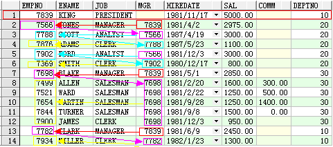

- [**Oracle**](#oracle)
  - [基本语法](#基本语法)
    - [添加列以及注释](#添加列以及注释)
    - [sqlplus 连接](#sqlplus-连接)
  - [逗号分隔转多行](#逗号分隔转多行)
  - [**Oracle 按照某字段指定顺序排序**](#oracle-按照某字段指定顺序排序)
    - [1. 通过order by instr实现指定顺序排序](#1-通过order-by-instr实现指定顺序排序)
    - [2. 通过order by decode](#2-通过order-by-decode)
    - [3. 使用拼音排序](#3-使用拼音排序)
    - [4. 使用部首排序](#4-使用部首排序)
    - [5. 使用笔画数排序](#5-使用笔画数排序)
  - [**计算近五年在职人数(待优化)**](#计算近五年在职人数待优化)
    - [MySQL的方式](#mysql的方式)
      - [思路](#思路)
    - [Oracle的方式](#oracle的方式)
      - [核心：](#核心)
      - [查询结果:](#查询结果)
      - [实战：](#实战)
      - [拓展使用(max,min,avg)](#拓展使用maxminavg)
      - [查询结果:](#查询结果-1)
  - [**decode函数的使用**](#decode函数的使用)
    - [使用decode判断字符串是否一样](#使用decode判断字符串是否一样)
    - [测试示例](#测试示例)
  - [**正则表达式使用**](#正则表达式使用)
    - [oracle 判断字段是否为是数字 regexp\_like用法 正则表达式](#oracle-判断字段是否为是数字-regexp_like用法-正则表达式)
  - [**左连接、右连接、全外连接、（+）号详解**](#左连接右连接全外连接号详解)
    - [右外连接（RIGHT OUTER JOIN/RIGHT JOIN）:](#右外连接right-outer-joinright-join)
    - [左外连接（LEFT OUTER JOIN/ LEFT JOIN）](#左外连接left-outer-join-left-join)
    - [Oracle中 (+)与left join 的用法区别](#oracle中-与left-join-的用法区别)
  - [**case 列名 when 和 case when的区别**](#case-列名-when-和-case-when的区别)
    - [Oracle connect by用法 以及to\_char转换星期几](#oracle-connect-by用法-以及to_char转换星期几)
  - [**算法**](#算法)
      - [问题描述：](#问题描述)
      - [示例](#示例)
    - [oracle 函数(储存过程)或表保存卡死,被锁定的解决方案](#oracle-函数储存过程或表保存卡死被锁定的解决方案)

# **Oracle** 
## 基本语法
### 添加列以及注释
```sql
ALTER TABLE "UDW_HIS"."T_GXJG_JZGJBXX_HIS" 
ADD ("CJGZSJ" VARCHAR2(100));

COMMENT ON COLUMN "UDW_HIS"."T_GXJG_JZGJBXX_HIS"."CJGZSJ" IS '参加工作时间'
```

### sqlplus 连接
```
sqlplus usr/pwd@//host:port/sid
sqlplus ODS/XjODS123@//202.115.154.76:1521/XJSJZXDB
```
## 逗号分隔转多行
```sql
--数据量8234
--9.959s rownum<100 9.873s
SELECT sksj,jxdd,SUBSTR(sksj,INSTR(';' || sksj || ';',';',1,RN.RN),INSTR(';' || sksj || ';',';',1,RN.RN+1) - INSTR(';' || sksj || ';',';',1,RN.RN) - 1) 
from T_JWXTZF_JW_JXRW_JXBXXB,(SELECT ROWNUM RN
                  FROM T_JWXTZF_ZFTAL_XTGL_JCSJB
                 WHERE ROWNUM < 10) RN
WHERE LENGTH(sksj) - LENGTH(REPLACE(sksj, ';', '')) + 1 >= RN.RN
and xnm=2023 and sksj is not null

--10.493s   level<=100 15.541s
SELECT sksj,jxdd,SUBSTR(sksj,INSTR(';' || sksj || ';',';',1,RN.RN),INSTR(';' || sksj || ';',';',1,RN.RN+1) - INSTR(';' || sksj || ';',';',1,RN.RN) - 1) 
from T_JWXTZF_JW_JXRW_JXBXXB,(
SELECT LEVEL RN FROM DUAL 
CONNECT BY LEVEL <= 10 )RN
WHERE LENGTH(sksj) - LENGTH(REPLACE(sksj, ';', '')) + 1 >= RN.RN
and xnm=2023 and sksj is not null

--超过100s未响应
SELECT sksj,jxdd,REGEXP_SUBSTR(sksj,'[^;]+',1,LEVEL) value
from T_JWXTZF_JW_JXRW_JXBXXB
where xnm=2023 and sksj is not null
CONNECT BY LEVEL <= REGEXP_COUNT(sksj, '[^;]+')
```
## **Oracle 按照某字段指定顺序排序**

### 1. 通过order by instr实现指定顺序排序

```sql
select * 
  from br_dict t
 order by instr('≤60㎡, 60-90㎡, 90-120㎡, 120-144㎡, 144-180㎡, 180-220㎡, >220㎡', mjd)
; 
```

### 2. 通过order by decode

```sql
select * 
  from br_dict t
 order by decode(mjd, '≤60㎡', 1, '60-90㎡', 2, '90-120㎡', 3, '120-144㎡', 4, '144-180㎡', 5, '180-220㎡', 6, '>220㎡', )
 ```

### 3. 使用拼音排序

```sql
select * 
  from order_tb t
 order by nlssort(py, 'NLS_SORT=SCHINESE_PINYIN_M') --desc
```

### 4. 使用部首排序

```sql
select * 
  from order_tb t
 order by nlssort(bs, 'NLS_SORT=SCHINESE_RADICAL_M') --desc
 ```

 ### 5. 使用笔画数排序

```sql
select * 
  from order_tb t
 order by nlssort(bh, 'NLS_SORT=SCHINESE_STROKE_M') --desc
 ```


## **计算近五年在职人数(待优化)**

### MySQL的方式
#### 思路
每一年入职的 - 每一年累计离职的 = 每一年在职的
```sql
SELECT (a.res-ifnull(b.res,0)) as res,round((a.res-ifnull(b.res,0))/(c.res-ifnull(d.res,0))*100,2)as `per`,a.sj as `name` from (
SELECT a.sj,sum(b.res) as res from(
SELECT ifnull(substr(lxrq,1,4),2000)as sj,count(1) as res from bigdata_rs_ryjbxx where gzgw='教师岗位' and zcdj='正高级' GROUP BY sj)a
LEFT JOIN (
SELECT ifnull(substr(lxrq,1,4),2000)as sj,count(1) as res from bigdata_rs_ryjbxx where gzgw='教师岗位' and zcdj='正高级' GROUP BY sj)b on a.sj>=b.sj
GROUP BY sj
)a LEFT JOIN (
SELECT a.sj,sum(b.res) as res from(
SELECT case when substr(jysj,1,4) is null  then 2000 else substr(jysj,1,4) end as sj,count(1) as res 
from bigdata_rs_ryjbxx where gzgw='教师岗位' and zcdj='正高级'and ryzt <>'在职' GROUP BY sj
)a
LEFT JOIN (
SELECT case when substr(jysj,1,4) is null then 2000 else substr(jysj,1,4) end as sj,count(1) as res 
from bigdata_rs_ryjbxx where gzgw='教师岗位' and zcdj='正高级' and ryzt <>'在职' GROUP BY sj
)b on a.sj>=b.sj
GROUP BY sj HAVING sj is not null
)b on a.sj=b.sj
LEFT JOIN(
SELECT a.sj,sum(b.res) as res from(
SELECT ifnull(substr(lxrq,1,4),2000)as sj,count(1) as res from bigdata_rs_ryjbxx where gzgw='教师岗位'  GROUP BY sj)a
LEFT JOIN (
SELECT ifnull(substr(lxrq,1,4),2000)as sj,count(1) as res from bigdata_rs_ryjbxx where gzgw='教师岗位' GROUP BY sj)b on a.sj>=b.sj
GROUP BY sj
)c on a.sj=c.sj
LEFT JOIN (
SELECT a.sj,sum(b.res) as res from(
SELECT case when substr(jysj,1,4) is null  then 2000 else substr(jysj,1,4) end as sj,count(1) as res 
from bigdata_rs_ryjbxx  where gzgw='教师岗位' and ryzt <>'在职' GROUP BY sj
)a
LEFT JOIN (
SELECT case when substr(jysj,1,4) is null  then 2000 else substr(jysj,1,4) end as sj,count(1) as res 
from bigdata_rs_ryjbxx where gzgw='教师岗位' and ryzt <>'在职' GROUP BY sj
)b on a.sj>=b.sj
GROUP BY sj HAVING sj is not null
)d on c.sj=d.sj
GROUP BY `name` HAVING `name` >(year(now())-5)
  ```

### Oracle的方式

#### 核心：
```sql
with student_info as (
  select 1 sno, 'a' sname, 80 score from dual union all
  select 2 sno, 'b' sname, 100 score from dual union all
  select 3 sno, 'c' sname, 120 score from dual union all
  select 4 sno, 'a' sname, 100 score from dual union all
  select 5 sno, 'b' sname, 200 score from dual
)

select si.sno 学号,
       si.sname 姓名,
       si.score 成绩,
       sum(si.score) over(order by si.sno) 累计成绩1,
       sum(si.score) over(partition by si.sname order by si.sno) 累计成绩2
  from student_info si
 order by si.sno;
```
#### 查询结果:
```
学号 姓名 成绩 累计成绩1 累计成绩2
1    a     80     80          80
2    b     100    180         180
3    c     120    300         300
4    a     100    400         400
```
#### 实战：
```sql
SELECT t1.res1 as "name",t1.res,round(t1.res/t2.res *100,2) as "per" from(
SELECT t1.res1,t1.res-nvl(t2.res,0) as res from(
SELECT t1.res1,sum(t1.res) over(ORDER by res1 ) as res from(
SELECT nvl(substr(lxrq,1,4),2000) as res1,count(1) as res FROM T_GXJG_JZGJBXX_X
where gzgw='教师岗位' 
GROUP BY nvl(substr(lxrq,1,4),2000)
)t1 )t1 LEFT JOIN(SELECT t1.res1,sum(t1.res) over(ORDER by res1 ) as res from(
SELECT nvl(to_char(jysj,'yyyy'),2000) as res1,count(1) as res FROM T_GXJG_JZGJBXX_X
where gzgw='教师岗位' and ryzt <>'在职' 
GROUP BY nvl(to_char(jysj,'yyyy'),2000)
)t1)t2 on t1.res1=t2.res1 
where t1.res1>to_char(sysdate,'yyyy')-5 
)t1
LEFT JOIN (SELECT t1.res1,t1.res-nvl(t2.res,0) as res from(
SELECT t1.res1,sum(t1.res) over(ORDER by res1 ) as res from(
SELECT nvl(substr(lxrq,1,4),2000) as res1,count(1) as res FROM T_GXJG_JZGJBXX_X
GROUP BY nvl(substr(lxrq,1,4),2000)
)t1 )t1 LEFT JOIN(SELECT t1.res1,sum(t1.res) over(ORDER by res1 ) as res from(
SELECT nvl(to_char(jysj,'yyyy'),2000) as res1,count(1) as res FROM T_GXJG_JZGJBXX_X
where ryzt <>'在职' 
GROUP BY nvl(to_char(jysj,'yyyy'),2000)
)t1)t2 on t1.res1=t2.res1 
where t1.res1>to_char(sysdate,'yyyy')-5 )t2 on t1.res1=t2.res1
```
#### 拓展使用(max,min,avg)
```sql
-- 聚合函数 + over()
with student_info as (
  select 1 sno, 'a' sname, 80 score from dual union all
  select 2 sno, 'b' sname, 100 score from dual union all
  select 3 sno, 'c' sname, 120 score from dual
)
select si.sno 学号,
       si.sname 姓名,
       si.score 成绩,
       max(si.score) over(order by si.sno) 最大值,
       min(si.score) over(order by si.sno) 最小值,
       avg(si.score) over(order by si.sno) 平均值
  from student_info si;

```
#### 查询结果:
```
学号 姓名 成绩 最大值 最小值 平均值
1    a     80     80     80     80
2    b     100    100    100    100
3    c     120    120    120    120
```

## **decode函数的使用**
### 使用decode判断字符串是否一样
```sql
DECODE(value,if1,then1,if2,then2,if3,then3,...,else)
含义为
IF 条件=值1 THEN
　　　　RETURN(value 1)
ELSIF 条件=值2 THEN
　　　　RETURN(value 2)
　　　　......
ELSIF 条件=值n THEN
　　　　RETURN(value 3)
ELSE
　　　　RETURN(default)
END IF
```
### 测试示例
```sql
sql测试
select empno,decode(empno,7369,'smith',7499,'allen',7521,'ward',7566,'jones','unknow') as name from emp where rownum<=10
输出结果
7369  smith
7499  allen
7521  ward
7566  jones
7654  unknow
7698  unknow
7782  unknow
7788  unknow
7839  unknow
7844  unknow
```
## **正则表达式使用**
### oracle 判断字段是否为是数字 regexp_like用法 正则表达式
```sql
作者：kbkiss
链接：https://www.zhihu.com/question/454719867/answer/3187954624
来源：知乎
著作权归作者所有。商业转载请联系作者获得授权，非商业转载请注明出处。

--基本用法，是否包含某字符串 =like %36%
select * from xxxxx where  regexp_like(字段名,'条件');
 
if regexp_like(str,'^[0-9\.]+$')  --只包含数字0-9，,小数点.
 
--oracle判断字段是否是纯数字 (四种写法结果一样）
select * from xxxxx where regexp_like(loginid,'^[0-9]+[0-9]$');
select * from xxxxx where regexp_like(loginid,'^[0-9]+$');   --'+' 匹配前面的子表达式一次或多次。
select * from xxxxx where regexp_like(loginid,'^[[:digit:]]+$');
select * from xxxxx where  not regexp_like(loginid,'[^0-9]');  --^表示排除
 
--不是0-9纯数字 （二种写法结果一样）
select * from xxxxx where  regexp_like(loginid,'[^0-9]');  --^表示排除
select * from xxxxx where not regexp_like(loginid,'^[[:digit:]]+$');
 
--判断字段中是否只包含0-9，-字符（二种写法结果一样）
select * from xxxxx where regexp_like(APPLICATION,'^[0-9]|[-]$');  
--'|' 指明两项之间的一个选择。相当于or 例子'^([a-z]+|[0-9]+)$'表示所有小写字母或数字组合成的字符串。
select * from xxxxx where  regexp_like(APPLICATION,'[0-9-]');
 
--判断字段中是否只包含0-9，-字符, 或者空格 （五种写法结果一样）
select * from xxxxx where regexp_like(APPLICATION,'^[0-9]|[-]$') or regexp_like(APPLICATION,'^[ ]$');
select * from xxxxx where regexp_like(APPLICATION,'^[0-9]|[-]$|^[ ]$');  
select * from xxxxx where regexp_like(APPLICATION,'(^[0-9]|[-]$)|(^[ ]$)'); --'( )' 标记一个子表达式的开始和结束位置
select * from xxxxx where regexp_like(APPLICATION,'^[0-9]|[-]|[ ]$');
```
```sql
ORACLE中的支持正则表达式的函数主要有下面四个：
1，REGEXP_LIKE ：与LIKE的功能相似
2，REGEXP_INSTR ：与INSTR的功能相似
3，REGEXP_SUBSTR ：与SUBSTR的功能相似
4，REGEXP_REPLACE ：与REPLACE的功能相似
它们在用法上与Oracle SQL 函数LIKE、INSTR、SUBSTR 和REPLACE 用法相同，
但是它们使用POSIX 正则表达式代替了老的百分号（%）和通配符（_）字符。
POSIX 正则表达式由标准的元字符（metacharacters）所构成：
'^' 匹配输入字符串的开始位置，在方括号表达式中使用，此时它表示不接受该字符集合。
'$' 匹配输入字符串的结尾位置。如果设置了 RegExp 对象的 Multiline 属性，则 $ 也匹
配 '\n' 或 '\r'。
'.' 匹配除换行符之外的任何单字符。
'?' 匹配前面的子表达式零次或一次。
'+' 匹配前面的子表达式一次或多次。
'*' 匹配前面的子表达式零次或多次。
'|' 指明两项之间的一个选择。例子'^([a-z]+|[0-9]+)$'表示所有小写字母或数字组合成的
字符串。
'( )' 标记一个子表达式的开始和结束位置。
'[]' 标记一个中括号表达式。
'{m,n}' 一个精确地出现次数范围，m=<出现次数<=n，'{m}'表示出现m次，'{m,}'表示至少
出现m次。
\num 匹配 num，其中 num 是一个正整数。对所获取的匹配的引用。
字符簇： 
[[:alpha:]] 任何字母。
[[:digit:]] 任何数字。
[[:alnum:]] 任何字母和数字。
[[:space:]] 任何白字符。
[[:upper:]] 任何大写字母。
[[:lower:]] 任何小写字母。
[[:punct:]] 任何标点符号。
[[:xdigit:]] 任何16进制的数字，相当于[0-9a-fA-F]。
各种操作符的运算优先级
\转义符
(), (?:), (?=), [] 圆括号和方括号
*, +, ?, {n}, {n,}, {n,m} 限定符
^, $, anymetacharacter 位置和顺序
| 
*/
--创建表
create table fzq
(
id varchar(4),
value varchar(10)
);
--数据插入
insert into fzq values
('1','1234560');
insert into fzq values
('2','1234560');
insert into fzq values
('3','1b3b560');
insert into fzq values
('4','abc');
insert into fzq values
('5','abcde');
insert into fzq values
('6','ADREasx');
insert into fzq values
('7','123 45');
insert into fzq values
('8','adc de');
insert into fzq values
('9','adc,.de');
insert into fzq values
('10','1B');
insert into fzq values
('10','abcbvbnb');
insert into fzq values
('11','11114560');
insert into fzq values
('11','11124560');
--regexp_like
--查询value中以1开头60结束的记录并且长度是7位
select * from fzq where value like '1____60';
select * from fzq where regexp_like(value,'1....60');
--查询value中以1开头60结束的记录并且长度是7位并且全部是数字的记录。
--使用like就不是很好实现了。
select * from fzq where regexp_like(value,'1[0-9]{4}60');
-- 也可以这样实现，使用字符集。
select * from fzq where regexp_like(value,'1[[:digit:]]{4}60');
-- 查询value中不是纯数字的记录
select * from fzq where not regexp_like(value,'^[[:digit:]]+$');
-- 查询value中不包含任何数字的记录。
select * from fzq where regexp_like(value,'^[^[:digit:]]+$');
--查询以12或者1b开头的记录.不区分大小写。
select * from fzq where regexp_like(value,'^1[2b]','i');
--查询以12或者1b开头的记录.区分大小写。
select * from fzq where regexp_like(value,'^1[2B]');
-- 查询数据中包含空白的记录。
select * from fzq where regexp_like(value,'[[:space:]]');
--查询所有包含小写字母或者数字的记录。
select * from fzq where regexp_like(value,'^([a-z]+|[0-9]+)$');
--查询任何包含标点符号的记录。
select * from fzq where regexp_like(value,'[[:punct:]]');

 

正则表达式用于字符串处理、表单验证等场合，实用高效。现将一些常用的表达式收集于此，以备不时之需。

用户名：/^[a-z0-9_-]{3,16}$/

密码：/^[a-z0-9_-]{6,18}$/

十六进制值：/^#?([a-f0-9]{6}|[a-f0-9]{3})$/

电子邮箱：/^([a-z0-9_\.-]+)@([\da-z\.-]+)\.([a-z\.]{2,6})$/

URL：/^(https?:\/\/)?([\da-z\.-]+)\.([a-z\.]{2,6})([\/\w \.-]*)*\/?$/

IP 地址：/^(?:(?:25[0-5]|2[0-4][0-9]|[01]?[0-9][0-9]?)\.){3}(?:25[0-5]|2[0-4][0-9]|[01]?[0-9][0-9]?)$/

HTML 标签：/^<([a-z]+)([^<]+)*(?:>(.*)<\/\1>|\s+\/>)$/

Unicode编码中的汉字范围：/^[u4e00-u9fa5],{0,}$/

匹配中文字符的正则表达式： [\u4e00-\u9fa5]
评注：匹配中文还真是个头疼的事，有了这个表达式就好办了

匹配双字节字符(包括汉字在内)：[^\x00-\xff]
评注：可以用来计算字符串的长度（一个双字节字符长度计2，ASCII字符计1）

匹配空白行的正则表达式：\n\s*\r
评注：可以用来删除空白行

匹配HTML标记的正则表达式：<(\S*?)[^>]*>.*?</\1>|<.*? />
评注：网上流传的版本太糟糕，上面这个也仅仅能匹配部分，对于复杂的嵌套标记依旧无能为力

匹配首尾空白字符的正则表达式：^\s*|\s*$
评注：可以用来删除行首行尾的空白字符(包括空格、制表符、换页符等等)，非常有用的表达式

匹配Email地址的正则表达式：\w+([-+.]\w+)*@\w+([-.]\w+)*\.\w+([-.]\w+)*
评注：表单验证时很实用

匹配网址URL的正则表达式：[a-zA-z]+://[^\s]*
评注：网上流传的版本功能很有限，上面这个基本可以满足需求

匹配帐号是否合法(字母开头，允许5-16字节，允许字母数字下划线)：^[a-zA-Z][a-zA-Z0-9_]{4,15}$
评注：表单验证时很实用

匹配国内电话号码：\d{3}-\d{8}|\d{4}-\d{7}
评注：匹配形式如 0511-4405222 或 021-87888822

匹配腾讯QQ号：[1-9][0-9]{4,}
评注：腾讯QQ号从10000开始

匹配中国大陆邮政编码：[1-9]\d{5}(?!\d)
评注：中国大陆邮政编码为6位数字

匹配身份证：\d{15}|\d{18}
评注：中国大陆的身份证为15位或18位

匹配ip地址：\d+\.\d+\.\d+\.\d+
评注：提取ip地址时有用

匹配特定数字：
^[1-9]\d*$　 　 //匹配正整数
^-[1-9]\d*$ 　 //匹配负整数
^-?[1-9]\d*$　　 //匹配整数
^[1-9]\d*|0$　 //匹配非负整数（正整数 + 0）
^-[1-9]\d*|0$　　 //匹配非正整数（负整数 + 0）
^[1-9]\d*\.\d*|0\.\d*[1-9]\d*$　　 //匹配正浮点数
^-([1-9]\d*\.\d*|0\.\d*[1-9]\d*)$　 //匹配负浮点数
^-?([1-9]\d*\.\d*|0\.\d*[1-9]\d*|0?\.0+|0)$　 //匹配浮点数
^[1-9]\d*\.\d*|0\.\d*[1-9]\d*|0?\.0+|0$　　 //匹配非负浮点数（正浮点数 + 0）
^(-([1-9]\d*\.\d*|0\.\d*[1-9]\d*))|0?\.0+|0$　　//匹配非正浮点数（负浮点数 + 0）
评注：处理大量数据时有用，具体应用时注意修正

匹配特定字符串：
^[A-Za-z]+$　　//匹配由26个英文字母组成的字符串
^[A-Z]+$　　//匹配由26个英文字母的大写组成的字符串
^[a-z]+$　　//匹配由26个英文字母的小写组成的字符串
^[A-Za-z0-9]+$　　//匹配由数字和26个英文字母组成的字符串
^\w+$　　//匹配由数字、26个英文字母或者下划线组成的字符串

去除精度纬度中非浮点数

 select jd,wd from xx_xa_xsczaqpc t where t.id not in  (

select id from xx_xa_xsczaqpc where regexp_like(jd,'^[1-9]\d*\.\d*|0\.\d*[1-9]\d*$')) ; 

是双小数点的数

select xx_jbxx_id,jd,wd from xx_xa_xsczaqpc t where regexp_like(jd,'^[1-9]\d*\.\d*\.\d*[1-9]\d*$') 
```

## **左连接、右连接、全外连接、（+）号详解**
左外连接（左边的表不加限制）
右外连接（右边的表不加限制）
全外连接（左右两表都不加限制）
连接（左右两表交集）


在左连接和右连接时都会以一张表为基础表，另一张表为补充表，基础表的内容会全部显示，然后再加上两张表匹配的内容。 如果基础表的数据在补充表中没有记录， 那么在相关联的结果集行中补充表列显示为空值（NULL）。

对于外连接， 也可以使用“(+) ”来表示。 关于使用（+）的一些注意事项：
```
（+）操作符只能出现在 WHERE 子句中，并且不能与 OUTER JOIN 语法同时使用。
 当使用（+）操作符执行外连接时，如果在WHERE子句中包含有多个条件，则必须在所有条件中都包含(+)操作符。
（+）操作符只适用于列，而不能用在表达式上。
（+）操作符不能与 OR 和 IN 操作符一起使用。
（+）操作符只能用于实现左外连接和右外连接，而不能用于实现完全外连接。
```
### 右外连接（RIGHT OUTER JOIN/RIGHT JOIN）:
```sql
select * from A a right join B b on a.id = b.id;
用（+）来实现， 这个+号可以这样来理解： + 表示补充，即哪个表有加号，这个表就是匹配表。如果加号写在左表，右表就是全部显示，所以是右连接。
select * from A a,B b where a.id(+)=b.id;
```
### 左外连接（LEFT OUTER JOIN/ LEFT JOIN）
```sql 
select * from A a left join B b on a.id = b.id;
用（+）来实现， 这个+号可以这样来理解： + 表示补充，即哪个表有加号，这个表就是匹配表。如果加号写在左表，右表就是全部显示，所以是左连接。
select * from A a,B b where a.id=b.id(+);
```
### Oracle中 (+)与left join 的用法区别
1. (+) 写在 where 后面,不能与 or/in 连用, a表是主表，b表是附属表。
```
select * from a,b where a.id=b.id(+);
```
2. 左连接写在 from 与where之间，a left join b  on a.id=b.id  ：主表a left join 附表b  on 连接条件。
```
select * from a left join b on a.id=b.id;
```
3.效率上没区别，left join 可读性高、功能更全面、通用性强、而且是新标准，建议使用**left join**。

## **case 列名 when 和 case when的区别**
case具有两种格式。简单case函数和case搜索函数。
```sql
--简单case函数
case sex
  when '1' then '男'
  when '2' then '女'
  else '其他' end
--case搜索函数
case when sex = '1' then '男'
     when sex = '2' then '女'
     else '其他' end
```
这两种方式，可以实现相同的功能。简单case函数的写法相对比较简洁，但是和case搜索函数相比，功能方面会有些限制，比如写判定式。

还有一个需要注重的问题，case函数只返回第一个符合条件的值，剩下的case部分将会被自动忽略。


```sql
CREATE OR REPLACE Function F_Get_BinaryDesc(vBinary in integer, vUnit in Varchar)
Return varchar2 as
type Type_weekArray is table of int;
aWeek integer; ---周变量
WeeksDesc varchar2(100); ---周显示组合
firstWeek integer; --第一周
currWeek integer; --当前的周
prevWeek integer; --前一个周
weekCount integer; --周数
aPrevArrayType integer; --前一个组合类型（1单，0双）
i integer;
weekArray Type_weekArray := Type_weekArray(); ---周数组
v_Binary integer;

begin
v_Binary := vBinary;
if v_Binary = 0 then
return '无';
end if;
WeeksDesc := null;
firstWeek := -1;
currWeek := -1;
prevWeek := -1;
aPrevArrayType := 2;
i := 1;
for aWeek in 0 .. log(2, v_Binary) loop
---log(2,vBinary)取整
if bitand(v_Binary, power(2, aWeek)) = power(2, aWeek) then
  ---利用位运算取出二进制数对应的第几周次
  weekArray.Extend;
  weekArray(i) := aWeek + 1;
  weekCount := i;
  i := i + 1;
end if;
end loop;

for i in 0 .. weekCount loop

--处理第一周

if firstWeek = -1 then

  firstWeek := weekArray(i + 1);

else

  if i = weekCount then

    currWeek := 0;

  else

    currWeek := weekArray(i + 1);

  end if;

  if prevWeek = firstWeek then

    if (currWeek - prevWeek = 1) then

      aPrevArrayType := 2;

    else

      aPrevArrayType := prevWeek mod 2;

    end if;

  end if;

end if;

--处理后续

if (i = weekCount) or (currWeek - prevWeek > 2) or

   ((currWeek - prevWeek = 2) and (aPrevArrayType <> currWeek mod 2)) or

   ((currWeek - prevWeek = 1) and (aPrevArrayType <> 2)) then

  if WeeksDesc is null then

    WeeksDesc := to_char(firstWeek);

  else

    WeeksDesc := WeeksDesc || ',' || to_char(firstWeek);

  end if;

  if (prevWeek <> -1) and (prevWeek > firstWeek) then

    WeeksDesc := WeeksDesc || '-' || to_char(prevWeek) || vUnit;

    if aPrevArrayType = 1 then

      WeeksDesc := WeeksDesc || '(单)';

    end if;

    if aPrevArrayType = 0 then

      WeeksDesc := WeeksDesc || '(双)';

    end if;

  else

    WeeksDesc := WeeksDesc || vUnit;

  end if;

  firstWeek := currWeek;

  prevWeek  := currWeek;

else

  prevWeek := weekArray(i + 1);

end if;
end loop;

return WeeksDesc;

end;

```


### [Oracle connect by用法 以及to_char转换星期几](https://www.cnblogs.com/linjiqin/p/3152690.html)
**to_char转换星期几**
```sql
-- 需要注意to_char(SYSDATE,'D')是周日到周六，周日=1
SELECT to_char(SYSDATE,'DAY'),to_char(SYSDATE,'D')  from dual;

SELECT (TRUNC(SYSDATE - 6) + ROWNUM - 1) AS DAYNAME
FROM DUAL CONNECT BY ROWNUM <= 7
								
SELECT to_char(TRUNC(SYSDATE)+ ROWNUM,'D')-1,to_char(TRUNC(SYSDATE)+ ROWNUM,'DAY')  from dual CONNECT BY ROWNUM <= 7
```
**Oracle connect by用法**<br>
先用scott用户下的emp表做实验.<br>
emp表有个字段，一个是empno(员工编号)，另一个是mgr(上级经理编号)<br>
下面是表中所有数据<br>

```sql {.line-numbers}
select * from emp start with empno=7698 connect by  mgr=prior empno;
```
执行结果：

<br>
得到的结果是empno=7698的数据，以及会得到mgr=7698的数据。<br>
它是向下递归的, 即我们从empno=7698开始遍历，去找出mgr=7698的所有数据S(用S代表查出的所有数据.), 然后在从S中的empno的值去匹配查找是否还有满足，mgr in (s.empno)的数据。一直遍历进去到没有数据为止。 <br>
 下面的这个可以详细的表述效果。
 <br>
```sql {.line-numbers}
--向下递归遍历
select * from emp connect by mgr= prior empno start with empno=7839;
```
执行结果如下：<br>


```sql
--向上递归遍历
select * from emp connect by prior mgr=empno start with empno=7844;
```
执行结果如下：<br>

这样直到没有匹配的数据为止。
以上只是简单的举了个例子。

connect by是结构化查询中用到的，其基本语法是：
```sql
select ... from tablename
start by cond1
connect by cond2
where cond3
```
简单说来是将一个树状结构存储在一张表里，比如一个表中存在两个字段(如emp表中的empno和mgr字段):empno, mgr那么通过表示每一条记录的mgr是谁，就可以形成一个树状结构。

用上述语法的查询可以取得这棵树的所有记录。
其中：<br>
cond1是根结点的限定语句，当然可以放宽限定条件，以取得多个根结点，实际就是多棵树。<br>
cond2是连接条件，其中用prior表示上一条记录，比如connect by prior id=praentid就是说上一条记录的id是本条记录的praentid，即本记录的父亲是上一条记录。<br>
cond3是过滤条件，用于对返回的所有记录进行过滤。<br>
prior和start with关键字是可选项<br>
prior运算符必须放置在连接关系的两列中某一个的前面。对于节点间的父子关系，prior运算符在一侧表示父节点，在另一侧表示子节点，从而确定查找树结构是的顺序是自顶向下还是自底向上。在连接关系中，除了可以使用列名外，还允许使用列表达式。<br>
start with子句为可选项，用来标识哪个节点作为查找树型结构的根节点。若该子句被省略，则表示所有满足查询条件的行作为根节点。

## **算法**
#### 问题描述：
把十进制数转换成二进制数，转换的二进制数的第几位数代表每学期的第几周，根据参数里的开始日期和星期几，求出具体日期集合。

#### 示例
```
**输入描述：**<br>
20230904 64 1  
解释：第一个参数表示开始日期，第二个参数表示十进制数，第三个参数表示星期几。

**输出描述** ：<br>
 64 为 10000000，表示第7周，1表示星期1，所以具体日期集合是 20230904
```

```
**输入描述：**<br>
20230904 255 2  
解释：第一个参数表示开始日期，第二个参数表示十进制数，第三个参数表示星期几。

**输出描述** ：<br>
 255 为 11111111，表示第1-8周，2表示星期2，所以具体日期集合是 20230905,20230912,20230919,20230926,20231003,20231010,20231017,20231024
```

```
**输入描述：**<br>
20230904 130976 1  
解释：第一个参数表示开始日期，第二个参数表示十进制数，第三个参数表示星期几。

**输出描述** ：<br>
 130976 为 11111111110100000，表示第6周，8-17周，1表示星期1
```

```sql
CREATE OR REPLACE FUNCTION F_GET_RECENTDATES(
  p_start_date IN VARCHAR2,
  week_Binary IN NUMBER ,
  jc_Binary IN NUMBER ,
	p_day_of_week IN NUMBER --星期几
) RETURN VARCHAR2 AS
  cur_week NUMBER; --获取当前周
  cur_jc VARCHAR2(30); --获取当前节次
  v_current_date DATE; --获取当前周日期
  v_week_counter NUMBER;--获取当前存入周
  v_dates VARCHAR2(1000);--返回结果
BEGIN
--   cur_week := CEIL((SYSDATE - TO_DATE(p_start_date, 'yyyymmdd')) / 7);
  cur_week := 8;--测试使用
	v_week_counter:=1;
	-- 周次段为空返回空
  IF week_Binary = 0 THEN
    RETURN ''; 
  END IF;
  cur_jc:=F_GET_JCBINARYDESC_T(jc_Binary,'');
  FOR aWeek IN 0 .. LOG(2, week_Binary) LOOP
    IF (aWeek+1) < cur_week or ((aWeek+1)-cur_week)>4 THEN --以前的不取，一个月以后的不取
      CONTINUE; 
    END IF;
		if bitand(week_Binary, power(2, aWeek)) = power(2, aWeek) then
		v_current_date:=trunc(TO_DATE(p_start_date, 'yyyymmdd') + (aWeek * 7) + (p_day_of_week - 1));
		IF v_week_counter <=4 THEN
			v_dates := v_dates || TO_CHAR(v_current_date, 'yyyymmdd') ||' '||cur_jc||',';
			v_week_counter := v_week_counter+1;
		ELSe
			exit;
    END IF;
		end if;
  END LOOP;
  
  RETURN SUBSTR(v_dates, 1, LENGTH(v_dates)-1);
END;

```


```sql
SELECT t1.jxbmc as "class_number",t2.sksj as "listen_time",replace(replace(t2.cdmc,'宜宾',''),'彭州校区','') as "listen_address" FROM "ODS"."T_JWXTZF_JW_JXRW_JXBXXB" t1 
LEFT JOIN(SELECT t1.jxb_id,'星期'||t1.xqj||'第'||F_GET_JCBINARYDESC(t1.jc,'')||'节'||'{'||F_GET_WEEKSDESC(t1.zcd)||'}' sksj,t3.cdmc
FROM "ODS"."T_JWXTZF_JW_PK_KBSJB" t1,"ODS"."T_JWXTZF_JW_PK_KBCDB" T2,(SELECT case when cdbh='1267' then '1267' else cd_id end as cdid,cdmc from "ODS"."T_JWXTZF_JW_JCDM_CDJBXXB") t3
where T1.KB_ID = T2.KB_ID(+) and T2.cd_id = T3.cdid(+) 
and t1.xnm =case when to_char(sysdate,'mm')>'07' then to_char(sysdate,'yyyy') else to_char(ADD_MONTHS(sysdate, -12),'yyyy') end
and t1.xqm =case when to_char(sysdate,'mm') BETWEEN '02' and '07' then '12' else '3' end)t2 on t1.jxb_id=t2.jxb_id
WHERE t1.xnm =case when to_char(sysdate,'mm')>'07' then to_char(sysdate,'yyyy') else to_char(ADD_MONTHS(sysdate, -12),'yyyy') end
and t1.xqm =case when to_char(sysdate,'mm') BETWEEN '02' and '07' then '12' else '3' end 
and kkzt<>4 and jxbmc not like '结业换证%' and yxzrs<>0 and sfzjxb='1' and jxdd is not null 
and cdmc not like '%不用%'and cdmc not in ('外出考察','线上上课')

```


### oracle 函数(储存过程)或表保存卡死,被锁定的解决方案
```sql
最近在写存储过程的时候，因为要测试存储过程的运行情况，中途操作失误，导致存储过程死锁，写了半天的东西编译不了了，没办法只能重新创建一个存储过程，以前的那个删也删不掉，用也用不了，很难受，最后是重启了数据库才解决这个问题。不过现在找到一种更简单的方法解决这个问题。
四步解决：
1、执行语句

select object_name,machine,s.sid,s.serial#
from v$locked_object l,dba_objects o ,v$session s
where l.object_id　=　o.object_id and l.session_id=s.sid;
查出来哪些对象被锁，得到sid

2、还是执行语句
alter system kill session '24,111'; (其中24,111分别是上面查询出的sid,serial#)
kill该session （sid,serial#即为上面查出来的sid和serial#）
注：此语句只是将该存储过程的状态由active改为了killed，并没有彻底的释放该存储过程，所以还是编译不了存储过程

3、要解决这一问题只能在OS上杀死这一线程（进程）了
执行语句获得线程（进程）号

select spid, osuser, s.program
from v$session s,v$process p
where s.paddr=p.addr and s.sid=24 
（24是上面的sid）

4、在服务器上执行下列命令（数据库在哪台机子，就在哪台机子执行）
orakill sid thread
orakill是oracle提供的命令，一般装oracle的时候，已经配上环境变量，这里可直接运行
其中sid为该存储过程所在数据库的实例名我的为orcl
thread即为线程（进程）号，即第三步查出来的spid。

以上就是解决存储过程的死锁问题了，也是从别人那取经回来的东西，写出来，主要就是为了加强记忆


-- 查询锁住  F_GET_RECENTDATES F_GET_JC
ALTER SYSTEM DISCONNECT SESSION '650,10235' IMMEDIATE;

ALTER SYSTEM KILL SESSION '650,10235' IMMEDIATE;

SELECT * 
FROM v$session where status='ACTIVE' and schemaname='ODS'

SELECT * from  v$sql WHERE sql_text LIKE '%F_GET_JCBINARYDESC_T%';


SELECT s.sid||','||s.serial#, s.username, s.status,sq.sql_text
FROM  v$sql sq, v$session s
WHERE   sq.sql_id  = s.sql_id
AND sq.sql_text LIKE '%F_GET_JC%';
	
	
select spid, osuser, s.program
from v$session s, v$process p
where s.paddr = p.addr
and s.sid =&sid;


SELECT  * from v$process
```

```sql

WITH campus as (  SELECT xqh id,xqmc name,'0' parent_id FROM "ODS"."T_JWXTZF_ZFTAL_XTGL_XQDMB" where xqh in (1,2,4)   ) ,
building AS (SELECT to_char(rownum+10) id,jxldm,jxlmc name,xqh_id parent_id FROM "ODS"."T_JWXTZF_JW_JCDM_JXLDMB" where sfqy=1 ORDER BY jxldm),
rooms AS (SELECT to_char(rownum+100) id,cdbh,cdmc name,xqh_id,lh,lch FROM "ODS"."T_JWXTZF_JW_JCDM_CDJBXXB" t1 where cdkyzt>3 and t1.cdlb_id not in('EE4763DDE6C1043EE053099F73CA0838') and t1.cdmc not in ('线上上课','线上考试') and t1.cdmc not like '不用教室%')
SELECT id, name, parent_id
FROM campus
union ALL
SELECT id, name, parent_id
FROM building
union ALL
SELECT r.id, r.name, nvl(b.id,r.xqh_id)
FROM rooms r LEFT JOIN building b on r.lh=b.jxldm

```


```sql
CREATE OR REPLACE FUNCTION F_GET_JC(--节次转换时间
  firstJc IN NUMBER, 
  prevJc IN NUMBER
) RETURN VARCHAR2 IS
  v_result_date VARCHAR2(50);
BEGIN
   v_result_date:= CASE firstJc 
		WHEN 1 THEN '08:00'
		WHEN 2 THEN '08:55'
		WHEN 3 THEN '10:00'
		WHEN 4 THEN '10:55'
		WHEN 5 THEN '14:00'
		WHEN 6 THEN '14:55'
		WHEN 7 THEN '16:00'
		WHEN 8 THEN '16:55'
		WHEN 9 THEN '19:00'
		WHEN 10 THEN '19:55'
		WHEN 11 THEN '20:50' END ||'-'||CASE prevJc 
		WHEN 1 THEN '08:45'
		WHEN 2 THEN '09:40'
		WHEN 3 THEN '10:45'
		WHEN 4 THEN '11:40'
		WHEN 5 THEN '14:45'
		WHEN 6 THEN '15:40'
		WHEN 7 THEN '16:45'
		WHEN 8 THEN '17:40'
		WHEN 9 THEN '19:45'
		WHEN 10 THEN '20:40'
		WHEN 11 THEN '21:35' END;
  RETURN v_result_date;
END;
```


```sql
WITH campus as (  SELECT xqh id,xqmc name,'0' parent_id FROM "ODS"."T_JWXTZF_ZFTAL_XTGL_XQDMB" where xqh in (1,2,4)   ) ,
building AS (SELECT to_char(rownum+10) id,jxldm,jxlmc name,xqh_id parent_id FROM "ODS"."T_JWXTZF_JW_JCDM_JXLDMB" where sfqy=1 ORDER BY jxldm),
rooms AS (SELECT to_char(rownum+100) id,cdbh,cdmc name,xqh_id,lh,lch FROM "ODS"."T_JWXTZF_JW_JCDM_CDJBXXB" t1 where cdkyzt>3 and t1.cdlb_id not in('EE4763DDE6C1043EE053099F73CA0838') and t1.cdmc not in ('线上上课','线上考试') and t1.cdmc not like '不用教室%'),
address as (SELECT id, '-1' dm,name, parent_id
FROM campus
union ALL
SELECT id,'-1' , name, parent_id
FROM building
union ALL
SELECT r.id, r.cdbh, r.name, nvl(b.id,r.xqh_id)
FROM rooms r LEFT JOIN building b on r.lh=b.jxldm)
SELECT t1.jxbmc as "class_number",t3.jgh  as "teacher_number",t2.sksj as "listen_time",t4.id  as "address"
FROM (
SELECT jxb_id,jxbmc,xnm,xqm from "ODS"."T_JWXTZF_JW_JXRW_JXBXXB" t1
WHERE t1.xnm =case when to_char(sysdate,'mm')>'07' then to_char(sysdate,'yyyy') else to_char(ADD_MONTHS(sysdate, -12),'yyyy') end
and t1.xqm =case when to_char(sysdate,'mm') BETWEEN '02' and '07' then '12' else '3' end 
and kkzt<>4 and jxbmc not like '结业换证%' and yxzrs<>0 and sfzjxb='1' 
) t1 
INNER JOIN(
SELECT t1.jxb_id,F_GET_COURSEDATES('20240115',t1.zcd,t1.jc,t1.xqj) sksj,t1.jc,F_GET_JCBINARYDESC_t(t1.jc,'') skjc,cdbh cdmc
FROM "ODS"."T_JWXTZF_JW_PK_KBSJB" t1,"ODS"."T_JWXTZF_JW_PK_KBCDB" T2,(SELECT case when cdbh='1267' then '1267' else cd_id end as cdid,cdbh,cdmc from "ODS"."T_JWXTZF_JW_JCDM_CDJBXXB") t3
where T1.KB_ID = T2.KB_ID(+) and T2.cd_id = T3.cdid(+) 
and t1.xnm =case when to_char(sysdate,'mm')>'07' then to_char(sysdate,'yyyy') else to_char(ADD_MONTHS(sysdate, -12),'yyyy') end
and t1.xqm =case when to_char(sysdate,'mm') BETWEEN '02' and '07' then '12' else '3' end
and cdmc not like '%不用%'and cdmc not in ('外出考察','线上上课','外出调研(美设)') 
)t2 on t1.jxb_id=t2.jxb_id and t2.sksj is not null
LEFT JOIN (
SELECT t1.jxb_id,t2.jgh FROM "ODS"."T_JWXTZF_JW_JXRW_JXBJSRKB" t1 LEFT JOIN "ODS"."T_JWXTZF_JW_JG_JZGXXB" t2 on t1.jgh_id=t2.jgh_id
)t3 on t1.JXB_ID=t3.JXB_ID
LEFT JOIN address t4 on t2.cdmc=t4.dm
```


```sql
CREATE OR REPLACE FUNCTION F_GET_COURSEDATES_T(
  p_start_date IN VARCHAR2,
  ksz IN NUMBER ,
  jsz IN NUMBER ,
  dsz IN NUMBER ,--0 双 1 单 2单双
	xqj IN NUMBER --星期几
) RETURN VARCHAR2 AS
  cur_week NUMBER; --获取当前周
  cur_jc VARCHAR2(30); --获取当前节次
  v_current_date DATE; --获取当前周日期
  v_week_counter NUMBER;--获取当前存入周
  v_dates VARCHAR2(1000);--返回结果
BEGIN
  cur_week := CEIL((SYSDATE - TO_DATE(p_start_date, 'yyyymmdd')) / 7);
	v_week_counter:=1;
	-- 周次段为空返回空
  IF ksz = 0 or jsz = 0 or  dsz = 0  THEN
    RETURN ''; 
  END IF;
  FOR aWeek IN ksz .. jsz LOOP
	--单双周处理
		if dsz=0 and mod(aWeek,2)=1 then 
			CONTINUE; 
		ELSIF dsz=1 and mod(aWeek,2)=2 then 
		  CONTINUE; 
		end if;
		--以前的不取，一个月以后的不取
    IF aWeek < cur_week or (aWeek-cur_week)>4 THEN 
      CONTINUE; 
    END IF;
		--计算该周具体日期
		v_current_date:=trunc(TO_DATE(p_start_date, 'yyyy-mm-dd') + (aWeek * 7) + (xqj - 1));
		--超过一个月跳过
		 IF ceil(TRUNC(v_current_date - SYSDATE ))>30 or ceil(TRUNC(v_current_date -SYSDATE)) <0 THEN
       CONTINUE; 
      END IF;
		IF v_week_counter <=4 THEN
			v_dates := v_dates ||TO_CHAR(v_current_date, 'yyyy-mm-dd')||',';
			v_week_counter := v_week_counter+1;
		ELSe
			exit;
    END IF;
  END LOOP;
	-- 没有日期
	IF length(v_dates) < 2 THEN
    RETURN NULL; 
  END IF;
  v_dates :=SUBSTR(v_dates, 1, LENGTH(v_dates)-1);
  RETURN v_dates ;
END;
```

```sql 
--INT_LW_bigdata_supervise_courses
SELECT F_GET_UUID(16) AS id,t4.kcmc as course_name,t1.jxbmc as class_number,t1.yxzrs as total_student,nvl(T2.JGMC,t1.kkbm_id) as course_college,case t1.xqh_id when '1' then '郫都校区' when '2' then '彭州校区'when '3' then '人南校区'when '4' then '宜宾校区'when '5' then '联办校区' else '其他校区' end as belong_campus,CASE when t4.kch in ('192299119','192299129','192288039','192288049','192288059','192288069','192299029','232299039','222299019','222299029','192299059','192299069','192299079','192299089','192299099','192299109') then '1' else '2' end  course_type,1 as student_type,js1.jgh as teacher_number,js1.xm as teacher_name,t5.kclbmc||REPLACE(t3.kklxmc, '课程', '课') as course_nature,t6.jxbzc as course_grade_major,sysdate as created_at,sysdate as updated_at
FROM "ODS"."T_JWXTZF_JW_JXRW_JXBXXB" t1
LEFT JOIN (SELECT kch_id,kch,kcmc,kclbdm,kcxzdm,kkbm_id,zxs from "ODS"."T_JWXTZF_JW_JH_KCDMB") T4 on t1.kch_id=T4.kch_id
LEFT JOIN (SELECT jg_id,jgmc from "ODS"."T_JWXTZF_ZFTAL_XTGL_JGDMB") T2 ON T4.kkbm_id=T2.JG_ID
LEFT JOIN "ODS"."T_JWXTZF_JW_JH_KCLBDMB" t5 on T4.kclbdm=t5.kclbdm
LEFT JOIN "ODS"."T_JWXTZF_JW_JCDM_KKLXDMB" t3 on t1.kklxdm=t3.kklxdm
LEFT JOIN (SELECT t1.jxb_id,wm_concat(t2.bj) as jxbzc 
FROM "ODS"."T_JWXTZF_JW_JXRW_JXBHBXXB" t1 
LEFT JOIN(SELECT bh_id,bj FROM "ODS"."T_JWXTZF_ZFTAL_XTGL_BJDMB" where qyzt=1)t2 on t1.bh_id=t2.bh_id
GROUP BY jxb_id)t6 on t1.jxb_id=t6.jxb_id
LEFT JOIN (SELECT t1.jxb_id,t2.jgh,t2.xm FROM "ODS"."T_JWXTZF_JW_JXRW_JXBJSRKB" t1 LEFT JOIN (SELECT jgh_id,jgh,xm FROM "ODS"."T_JWXTZF_JW_JG_JZGXXB")t2 on t1.jgh_id=t2.jgh_id)JS1 on t1.jxb_id=js1.jxb_id
where t1.xnm =case when to_char(sysdate,'mm')>'07' then to_char(sysdate,'yyyy') else to_char(ADD_MONTHS(sysdate, -12),'yyyy') end
and  t1.xqm =case when to_char(sysdate,'mm') BETWEEN '02' and '07' then '12' else '3' end
/* 一年学年可分两个阶段取当前cur和前一年pre   学期分三个阶段取，1月为1学期，2345678为2学期，9 10 11 12 为1学期*/
and kkzt<>4 and jxbmc not like '结业换证%' and yxzrs<>0 and sfzjxb='1' and jxdd is not null
```

